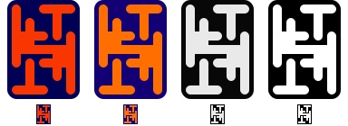
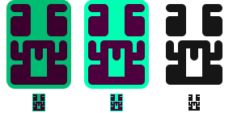
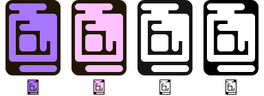
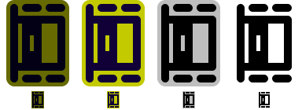
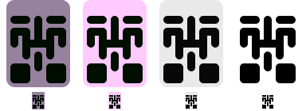
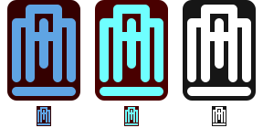

# BitSquiggles

BitSquiggles is an experimental visual encoding for comparing two already-derived
32-bit fingerprints. It turns the same value into the same compact pattern on
different devices, including devices with very small or monochrome displays.

The intended interaction is a side-by-side check: show the pattern on both
devices and look for a difference. A typical example is comparing a BIP-32
master-key fingerprint shown by a hardware wallet with the fingerprint shown
by its companion application.

The project provides dependency-free reference implementations for Java 17,
MicroPython-compatible Python, JavaScript, and C99. The algorithm and
conformance requirements are defined in [SPEC.md](SPEC.md); this README
deliberately stays at the project and design-rationale level.

## Rendered examples

Each sheet below is generated directly from the Java reference implementation.
The three columns are Standard, High Contrast, and Monochrome. Every column
contains an 80×110 smooth rendering above its native, unscaled 16×22 pixel
raster. The color changes between styles; the encoded geometry does not.

**Try any value in the [interactive playground](https://maggo83.github.io/BitSquiggles/).**
It runs entirely in the browser and creates a shareable link for each value.

| Input | Representative behavior | Rendered styles and native rasters |
| --- | --- | --- |
| `00000000` | Accepted half-turn (`A+`) |  |
| `00000001` | Half-turn capacity fallback to `A\|` |  |
| `00000003` | Accepted slash copy (`A/`) |  |
| `00000004` | Accepted top/bottom copy (`A-`) |  |
| `12345678` | Sparse left/right output (`A\|`) |  |
| `ffffffff` | Denser left/right output (`A\|`) |  |

## Quick start

Choose the target language in the [reference implementation guides](#reference-implementation-guides).
Each guide is the single source for its installation, core API, exact-raster,
optional-renderer, and test instructions.

## Why this project exists

Eight hexadecimal digits are compact but tiring to compare, especially on a
small screen. BitSquiggles explores whether a structured visual can make accidental
mismatches easier to notice without requiring color, antialiasing, or a large
display.

It is useful when all of the following are true:

- a protocol or application already has a meaningful 32-bit fingerprint;
- the same value can be displayed independently in two places;
- a person can inspect both displays at roughly the same time;
- the goal is convenient detection of accidental mismatch.

BitSquiggles does not decide what should be fingerprinted. Deriving the correct
32-bit input remains the caller's responsibility.

## Intended audience and uses

BitSquiggles is primarily for:

- hardware-wallet and companion-application developers;
- embedded-device developers working with low-resolution displays;
- researchers and designers experimenting with human comparison of short
  fingerprints;
- applications that want an additional visual cue alongside the underlying
  fingerprint.

The patterns are designed for equality comparison, preferably side by side.
They are not designed for recognizing an identity from memory or finding one
identity in a large collection.

## Non-goals and unsafe uses

### Not protection against a deliberate attacker

The input contains only 32 bits. A targeted collision is computationally
feasible, regardless of how those bits are displayed. BitSquiggles is not a
cryptographic authentication mechanism and must not be treated as one.

A random value matches one fixed 32-bit value with probability $1/2^{32}$.
That may be useful for detecting accidents, but it is not an adequate security
boundary against an attacker who can search for inputs.

### Not a replacement for complete identifiers

Do not reduce a Bitcoin address, payment destination, public key, transaction,
or other long identifier to 32 bits and then use BitSquiggles as the authorization
decision. Different identifiers can have the same 32-bit fingerprint and will
then correctly produce the same pattern.

Payment destinations and other security-sensitive identifiers still require
an appropriate exact or authenticated comparison of the complete value. A
BitSquiggle32 can only be an additional cue.

### Not a hash, checksum, or fingerprint derivation function

BitSquiggle32 accepts an unsigned 32-bit value. It does not:

- accept arbitrary strings or byte arrays;
- derive BIP-32 or other protocol fingerprints;
- prove possession of a key;
- add information that was discarded before the value reached BitSquiggle32;
- provide cryptographic collision resistance.

## Design assumptions and choices

The design is guided by the following assumptions. These are rationale, not a
substitute for the normative rules in [SPEC.md](SPEC.md).

### Geometry carries identity

The pattern must remain unambiguous when rendered without color. Hue, chroma,
and lightness are therefore redundant comparison cues rather than part of the
uniqueness argument. This also limits the effect of display clipping,
desaturation, quantization, or inversion.

### Structure is easier to compare than visual noise

The visualization uses connections in a small cell grid and several structured
copy families. Connections provide enough capacity to retain the full input,
while reflection-like, rotation-like, and diagonal copy structures give the
eye larger features to compare. Independent ternary cell states were rejected
because their small subpatterns were difficult to distinguish on real
low-resolution displays.

### Diffusion must not discard information

Nearby numeric inputs should not lead to nearby-looking outputs. BitSquiggle32 uses
a reversible 32-bit mixer rather than a many-to-one hash: it improves avalanche
while preserving the size and uniqueness of the input domain.

### Invisible metadata cannot establish uniqueness

The internal copy-family choice is not printed into the pattern, and different
families can produce the same geometry. BitSquiggle32 resolves such overlaps by a
canonical priority rule and a full-capacity fallback. Uniqueness is claimed for
the visible connection geometry, not for a hidden mode label.

### A tiny exact rendering is the portability baseline

The conformance representation is a fixed binary raster with no antialiasing.
Each connection has dedicated pixels, allowing the abstract geometry to be
recovered from the raster. Larger smooth renderings are presentation options;
they do not redefine the encoded value.

### Reference implementations should be easy to audit and port

The Java, Python, and JavaScript cores use no third-party runtime dependencies.
They follow the same specification and share conformance coverage. This favors
transparent, portable code over framework integration.

## History

BitSquiggles was inspired by
[Hallmarks](https://github.com/GBKS/hallmarks). Early experiments sought more
visual diversity on small screens and clearer patterns in monochrome pixel
renderings.

The initial idea was broader address verification. Discussion and prototyping
made the underlying limitation clear: a 32-bit visual cannot securely stand in
for a full address, and secure address verification also needs a trustworthy
communication or authentication path. The project was consequently narrowed
to convenient comparison of an already-defined short fingerprint.

Further iterations moved information from independent cells to connections,
introduced reversible mixing, and added canonical handling of overlapping copy
families.

Thanks go out to Christoph Ono for starting Hallmarks and early exchange,
Francis Pouliot for enthusiastic feedback, and Kevin Loaec and Orangesurf
for the critique and pointers to existing other approaches like LifeHash!

## Status

BitSquiggles is **experimental and unreleased**.

Current state:

- Java 17, MicroPython-compatible Python, JavaScript, and C99 implementations
  are present;
- each implementation includes a dependency-free test suite;
- the implementations share documented conformance vectors;
- uniqueness of the canonical connection mask is supported by a structural
  proof, while tests sample the implementation over large input sets;
- the Java implementation includes an interactive Swing demo;
- the MicroPython port includes optional LVGL exact-raster and smooth renderers;
- no independent security, cryptographic, accessibility, or usability review
  has been completed;
- no controlled user study has established how reliably people notice
  differences;
- smooth scaling, display defects, and human perception can still make two
  distinct patterns difficult to distinguish.

The mathematical uniqueness property should not be confused with a usability
or security guarantee.

Release versioning and publication requirements are defined in
[RELEASING.md](RELEASING.md); released changes are recorded in
[CHANGELOG.md](CHANGELOG.md).

## Keeping examples synchronized

The SVG sheets are generated files, not hand-maintained screenshots. After
cloning, enable the repository hook once:

```bash
git config core.hooksPath .githooks
```

The hook regenerates and stages the gallery during each commit. To regenerate
it manually after changing rendering behavior, run:

```bash
mkdir -p out/core
javac -d out/core java/core/module-info.java \
  java/bitsquiggles/BitSquiggle32.java \
  java/bitsquiggles/GalleryGenerator.java \
  java/bitsquiggles/ConformanceFixtureGenerator.java
java --module-path out/core --module io.github.maggo83.bitsquiggles/bitsquiggles.GalleryGenerator
java --module-path out/core --module io.github.maggo83.bitsquiggles/bitsquiggles.ConformanceFixtureGenerator
```

GitHub Actions also verifies the gallery on every push and pull request. The
`Verify generated gallery` workflow should be configured as a required status
check for `main`, so stale documentation cannot be merged if a local hook was
not enabled.

## Reference implementation guides

Every port guide uses the same headings: status and scope, include/install,
create a BitSquiggle, exact-raster rendering, optional smooth rendering,
conformance testing, package/release notes, and limitations/compatibility.

| Port | Primary targets | Guide |
| --- | --- | --- |
| Java | Java 17+ | [Java guide](java/README.md) |
| Python | CPython and MicroPython | [Python and MicroPython guide](micropython/README.md) |
| JavaScript | Browser, Node, and TypeScript consumers | [JavaScript and TypeScript guide](web/README.md) |
| C99 | Native and embedded C99 consumers | [C99 guide](c/README.md) |

The canonical identity and rendering requirements are defined once in the
[specification](SPEC.md#1-scope-and-contract). Smooth-renderer integration is
covered by each port guide.

## Repository guide

```text
README.md                  project purpose, audience, rationale, and status
SPEC.md                    normative behavior and implementation details
CONTRIBUTING.md            contribution workflow and validation expectations
AGENTS.md                  concise guide for coding agents
RELEASING.md               shared versioning and release procedure
CHANGELOG.md               released and planned change history
java/bitsquiggles/
  BitSquiggle32.java       Java reference implementation
  BitSquiggle32Test.java   Java conformance and property tests
  BitSquigglesDemo.java    Java Swing demonstration
  GalleryGenerator.java    Deterministic README example-sheet generator
  ConformanceFixtureGenerator.java Java-generated cross-language test fixtures
java/core/module-info.java  Headless core JPMS descriptor
java/renderer-swing/        Optional Swing/Java2D renderer JPMS module
  bitsquiggles/renderer/swing/BitSquiggle32RendererSwing.java
                            Smooth and exact renderers
java/README.md              Java integration and rendering guide
c/
  bitsquiggle32.h           C99 public core API
  bitsquiggle32.c           C99 core implementation
  test_bitsquiggle32.c      C99 conformance and property tests
  README.md                 C99 integration guide
micropython/
  bitsquiggle32.py         MicroPython-compatible implementation
  bitsquiggles_renderer_lvgl.py Optional LVGL exact-raster and smooth renderers
  test_bitsquiggle32.py    Python conformance and property tests
  README.md                 Python and MicroPython integration guide
docs/examples/             Generated README example sheets
fixtures/v1.json           Versioned cross-language conformance fixture
pyproject.toml              CPython package metadata for `bitsquiggle32`
web/                       Static GitHub Pages playground, ESM package, and tests
  bitsquiggle32-renderer-canvas.js Optional Canvas 2D renderer
  playground.js             Live playground application
web/README.md               JavaScript and TypeScript integration guide
.githooks/pre-commit       Regenerates and stages example sheets locally
.github/workflows/         Verifies generated files, runs tests, and deploys Pages
```

When behavior, constants, or formats change, update [SPEC.md](SPEC.md) and the
conformance tests together. When rendering changes, regenerate
`docs/examples/` and `fixtures/v1.json` with their Java generators as
described above. Keep project motivation, safety boundaries, status, and
trade-offs here; keep normative behavior in the specification; and keep
language-specific setup and rendering instructions in the port guides.

## License

The files retain the Grug 2-Clause license:

1. do what want
2. not sue grug
