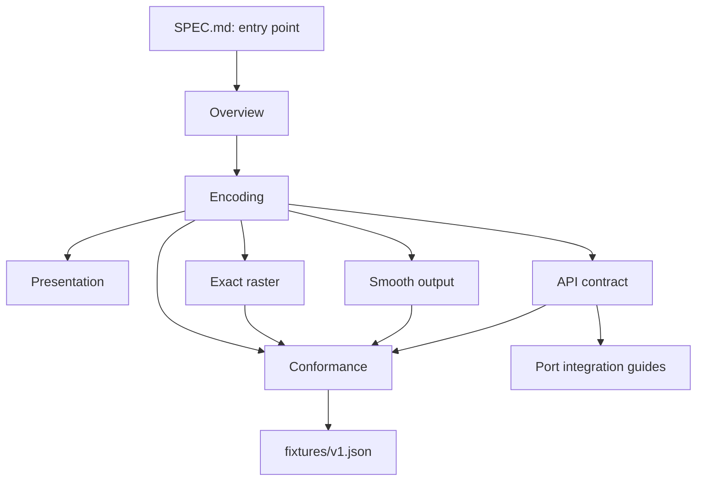

# BitSquiggles / BitSquiggle32 Specification

← Back to the [BitSquiggles project overview](README.md), including project
status, safety boundaries, implementation guides, and license.

**Normative.** This index and the linked chapters together are the technical
source of truth for BitSquiggle32. Project motivation, audience, history, and
design trade-offs belong in [README.md](README.md). Target-specific names,
installation, integration, and test commands belong in the port guides.

## Contract at a glance

BitSquiggle32 maps one unsigned 32-bit integer to a deterministic visual
specification. Its identity-bearing output is a 58-bit canonical connection
mask over a fixed grid. The exact 16×22 binary raster preserves that mask
without loss.

For conforming implementations:

```text
equal inputs   => equal connection masks and exact rasters
unequal inputs => unequal connection masks and exact rasters
```

This is a geometry and exact-raster guarantee. It does not guarantee that
people can distinguish every pair after arbitrary scaling, smoothing, display
degradation, or brief observation. The caller supplies the uint32 value;
BitSquiggle32 does not derive Bitcoin fingerprints or define a byte order.

## Normative chapters

Read the chapters in their listed dependency order. Each chapter is the sole
normative owner of the detailed rules in its subject.

| Chapter | Purpose | Read when |
| --- | --- | --- |
| [Overview](spec/01-overview.md) | Observable contract and processing model | Starting an implementation or evaluating the guarantee |
| [Encoding](spec/02-encoding.md) | Dimensions, mixer, templates, assignment, canonicalization, and uniqueness proof | Implementing the uint32-to-mask transformation |
| [Presentation](spec/03-presentation.md) | Active cells, styles, color derivation, and sRGB conversion | Implementing non-binary presentation |
| [Exact raster](spec/04-exact-raster.md) | The lossless 16×22 binary output | Drawing to monochrome or pixel-grid targets |
| [Smooth output](spec/05-smooth-output.md) | Smooth-rendering constraints and canonical blobs | Adding an antialiased renderer |
| [API contract](spec/06-api.md) | Required core operations and renderer façade | Designing a core or renderer public surface |
| [Conformance](spec/07-conformance.md) | Required checks, vector, and generated-output ownership | Verifying or releasing a port |



## Task-oriented reading paths

| Task | Minimum reading path |
| --- | --- |
| Understand the guarantee | This index → [overview](spec/01-overview.md) → [encoding](spec/02-encoding.md) |
| Implement a conforming core | Overview → encoding → presentation → [API](spec/06-api.md) → [conformance](spec/07-conformance.md) |
| Add a raster renderer | Overview → encoding through `pixels()` → [exact raster](spec/04-exact-raster.md) → [API](spec/06-api.md) → [conformance](spec/07-conformance.md) |
| Add a smooth renderer | Overview → encoding → [smooth output](spec/05-smooth-output.md) → [API](spec/06-api.md) → [conformance](spec/07-conformance.md) |
| Verify a port | Overview → [API](spec/06-api.md) → [conformance](spec/07-conformance.md) → target port guide |
| Choose or install a port | [Project overview](README.md) → target port guide → [API](spec/06-api.md) |

## Conformance language and change policy

The words **must**, **must not**, **should**, and **may** in the normative
chapters indicate requirement strength. A conforming implementation satisfies
all **must** and **must not** statements.

The versioned cross-port fixture is [fixtures/v1.json](fixtures/v1.json).
Generated gallery examples are in [docs/examples/](docs/examples/). Their Java
generators and validation commands are owned by
[the conformance chapter](spec/07-conformance.md) and the
[Java guide](java/README.md#6-test-conformance).

Any behavior, constants, format, public API, or fixture change requires an
explicit compatibility review, synchronized maintained-port conformance, and
release treatment under [RELEASING.md](RELEASING.md). Keep implementation
changes and the affected normative chapters synchronized.

## Related

- Project and port selection: [README.md](README.md)
- Contribution workflow: [CONTRIBUTING.md](CONTRIBUTING.md)
- Release policy: [RELEASING.md](RELEASING.md)
